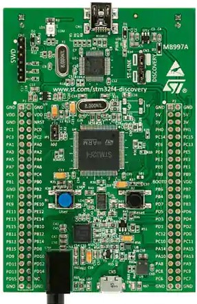

# ARM-CortexM4-HSE Clock

## Requirements 

### Hardware
* STM32F407G-DISC1 (Development Kit)
* Micro-USB to USB-A
* USB Digital Logic Analyser
### Software
* STM32Cube IDE

### Hardware Specifiations
* Core Architecture - Arm
* Data Bus Width - 32bits
* Memory Size - 1MB
* RAM Size - 192kB
* Interface - CAN, Ethernet, I2C, SPI, UART, USART and USB

### Board

### Output

HSE(High Speed External Clock) from the developement kit is channeled to Pin PA-8. The Clock signal can be observed on Pin PA-8 usiung digital logic analyser.

### Circuit Diagram

